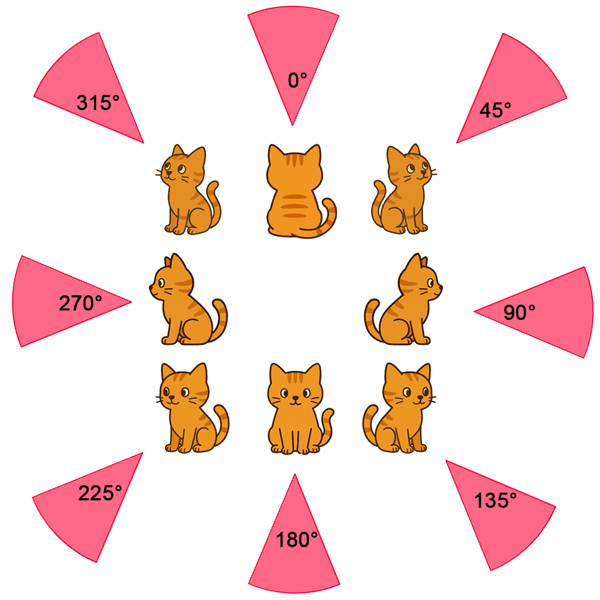
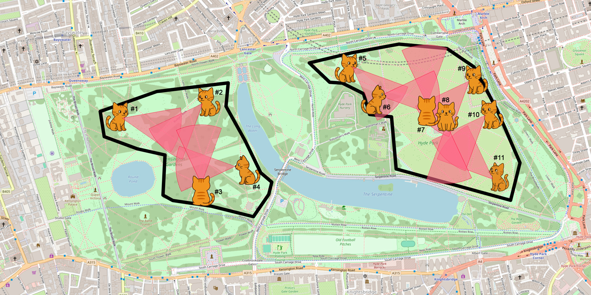

# Geospatial Optimization

This package provides tools and algorithms for geospatial optimization of **stationary sensors** placement. It includes functionalities for defining operational areas, simulating sensor coverage, and visualizing the results.

## Intuition

Imagine that Hyde Park in London is now plagued with rats (targets), and your goal is to strategically place a limited number of cats (sensors) so that as many rats as possible are detected. The challenge is to optimize the placement of these cats to maximize coverage, given constraints like the number of cats and their sensing range. This package helps you model such scenarios, run optimization algorithms, and visualize the results.

Cats can be configured with various properties, such as sensing range and azimuth (directional orientation). This means you can model scenarios where each cat not only has a specific detection distance but also a particular direction it faces, allowing for more realistic and flexible optimization of sensor placement.



**Linear programming** techniques are used to determine the optimal placement of cats. By formulating the problem as a set of mathematical constraints and objectives, linear programming efficiently finds the best arrangement of cats to maximize the size of detection area while respecting limits such as the number of available cats and their sensing ranges.



## Problem Formulation


**Objective Function**: Minimize the total number of cats (sensors) placed. Penalize excessive overlapping coverage by subtracting the number of times a target is covered more than once.

|ID |Constraint| Description|
|-----|-----|-----|
|1|Allocation matrix is binary|Each location/configuration can either have a cat or not.|
|2|Coverage vector is binary|Each target is either covered or not.|
|3|Coverage count is non-negative integer|Tracks how many times each target is covered.|
|4|Do not exceed available sensors|Cannot place more cats than available.|
|5|Achieve required coverage|At least a percentage $P$ of all targets must be covered.|
|6|Coverage count at least as large as coverage indicator|If a target is covered, its count must reflect that.|
|7|Limit excessive overlap|No target should be covered by more than 2 cats.|
|8|Link coverage to placement|A target is marked covered only if at least one cat can detect it.|
|9|Link coverage count to placement|The count of coverage for each target matches the number of cats that can detect it.|
|10|At most one sensor per location|Only one cat (with any configuration) can be placed at a given location.|

---
The mathematical problem formulation is shown below:

$$
\begin{aligned}
  & \text{Let} & 
      I         & = \text{No. of target locations} \\
  & & L         & = \text{No. of source locations} \\
  & & J         & = \text{No. of configurations} \\
  & & S         & = \text{No. of sensors} \\
  & & C_{i,l,j} & = \text{Coverage matrix} \\
  & & x_{l,j}   & = \text{Allocation matrix} \\ % IF location l with config j is allocated THEN 1 ELSE 0 END
  & & y_i       & = \text{Is convered vector} \\
  & & y_i^{'}   & = \text{Coverage count vector} \\
  & & P         & = \text{Percentage of coverage requirement} \\


  % Minimize number of sensors allocated.
  & \text{Minimize} & z & = \sum_{l=0}^{L}\sum_{j=0}^{J}x_{l,j} - \sum_{i=0}^{I}(y_i^{'}-1) \\


  & \text{Subject to} &&&&&   &\\

  % The allocation matrix x is binary
  & (1)         & x_{l,j}     & \in \{0,1\}       & \forall   & l   & = 1,2,3...,L & \\
  &             &             &                   & \forall   & j   & = 1,2,3...,J & \\

  % The cover matrix is binary
  & (2)         & y_{i}       & \in \{0,1\}       & \forall   & i   & = 1,2,3...,I & \\

  % The covered count variable is zero or a positive integer
  & (3)         & y_{i}^{'}   & \in \mathbb{Z}^{0+}   & \forall   & i   & = 1,2,3...,I & \\
 
  % Don't exceed the maximum number of available sensors
  & (4)         & x_{l,j}     & \leq S            & \forall   & l   & = 1,2,3...,L & \\
  &             &             &                   & \forall   & j   & = 1,2,3...,J & \\

  % Achieve the required percentage of grid point coverage
  & (5)         & \sum_{i=0}^{I} y_{i}
                              & \geq PI           &           &                    & \\
                              
  % The covered count variable (y_prime) should  be greater than or equal to the is_covered variable
  & (6)         & \sum_{i=0}^{I} y_{i}^{'}
                              & \geq \sum_{i=0}^{I} y_{i}
                                                  &           &                    & \\

  % Avoid excessively overlapping the sensors, currently limit at 2
  & (7)         & y_{i}       & \leq 2            & \forall   & i   & = 1,2,3...,I & \\

  % Link the is_covered variable to the placement variables
  & (8)         & \sum_{l=0}^{L}\sum_{j=0}^{J} C_{i,l,j} x_{l,j} 
                              & \geq y_i          & \forall   & i   & = 1,2,3...,I & \\
  
  % Link the covered_count variable to the placement variables
  & (9)         & \sum_{l=0}^{L}\sum_{j=0}^{J} C_{i,l,j} x_{l,j} 
                              & \geq y_i^{'}      & \forall   & i   & = 1,2,3...,I & \\

  % Ensure at most one sensor is placed at any given location
  & (10)         & \sum_{j=0}^{J}x_{l,j} 
                              & \leq 1            & \forall   & l   & = 1,2,3...,L & \\

  
\end{aligned}
$$


## Installation

1.  Clone the repository:

    ```bash
    git clone https://github.com/timothywong731/geospatial_optimization.git
    cd geospatial_optimization
    ```

2.  Install the required dependencies using Poetry. If you don't have Poetry installed, follow the instructions [here](https://python-poetry.org/docs/#installation):

    ```bash
    poetry install
    ```

3.  Activate the virtual environment created by Poetry:

    ```bash
    poetry shell
    ```

## Usage

The main functionalities are available in the `geospatial_optimization` package. You can use the provided modules (`optimization.py`, `plotting.py`, `helpers.py`) in your Python scripts or interactive sessions.

### Example (using the demo notebook)

A demonstration of how to use the library is provided in the `demo.ipynb` Jupyter notebook. To run the demo:

1.  Make sure you have Jupyter installed within your Poetry environment (`poetry add jupyter`).
2.  Launch the Jupyter notebook server from within the activated Poetry shell:

    ```bash
    jupyter notebook
    ```

3.  Open the `demo.ipynb` file in your browser and run the cells.

### Key Modules:

-   `geospatial_optimization.optimization`: Contains the core optimization algorithms for sensor placement.
-   `geospatial_optimization.plotting`: Provides functions for visualizing operational areas, sensor placements, and coverage.
-   `geospatial_optimization.helpers`: Includes utility functions used across the project.

